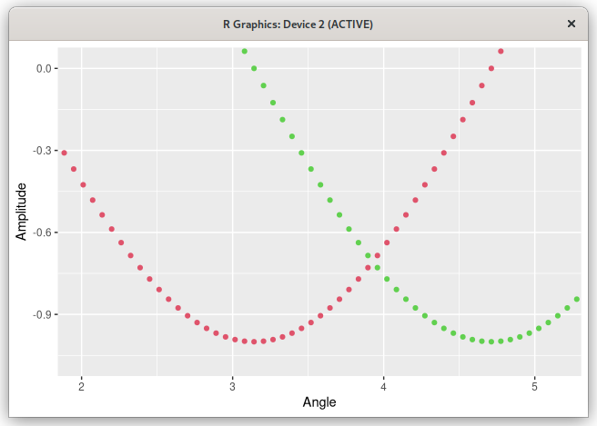

# Plane View
Yet another data plotter. It's intended to support a particular workflow.

* Call from R with data as arguments.
* Explore your data and adjust ranges.
* Return a ggplot command that can be tweaked to make a finished plot.

Plane View is not intended to produce publication-ready plots. It's not intended to be a fully featured interactive plot editor. Legends and labels are added in post.

The package *planeview* provides `pview()`, which can be called in four different ways:

1. One vector: `pview(ys)` plots the elements of `ys` vs. their indices.
1. Multiple vectors: `pview(xs, ys1, ys2, ...)` plots each of the y-vectors vs. `xs`.
1. One list of vectors: `pview(list(ys1, ys2, ...))` plots each y-vector vs. its indices.
1. Two lists of vectors: `pview(list(xs1, xs2, ...), list(ys1, ys2, ...))` plots each y-vector vs. the corresponding x-vector.

# Features
* Dragging a box changes the range.
* X- and y-ranges spanned by the box and corner-to-corner slope are displayed while dragging.
* Escape aborts range change.
* The previous two features give a convenient way to measured distances: Drag from one point
  on the graph to another. Read the range. Hit escape.
* Undo and redo are available for range changes.
* Mouse-wheel zooms centered on the pointer.
* Dragging on an axis scales just that dimension.
* Shift+drag moves the graph.
* Holding Ctrl provides coarse movement or scaling.
* Right-drag displays the coordinates of the point closest to the pointer.
* Overview: Show the graph autoscaled with a box around the current range. Move the box,
  drag edges or corners to set the new range. Could be used to look at different parts of
  a plot at a consistent magnification.

# Non-Features
Some things must be done in ggplot2 after leaving Plane View.

* Title and axis labels
* Legends
* Saving to a file

# Example
Here's an example session. The pview() call returns a ggplot call as a a string. Copy, paste, and add labels to get the finished plot.
```
> theta <- 1:100*pi/50
> pview(theta, cos(theta), sin(theta))
[1] "ggplot() + geom_point(aes(theta, cos(theta)), color=2) + geom_point(aes(theta, sin(theta)), color=3)
+ coord_cartesian(xlim=c(2, 5.15), ylim=c(-1.0722, 0.0217))"
> ggplot() + geom_point(aes(theta, cos(theta)), color=2) + geom_point(aes(theta, sin(theta)), color=3)
+ coord_cartesian(xlim=c(2, 5.15), ylim=c(-1.0722, 0.0217)) + labs(x='Angle', y='Amplitude')
```




# Possible Future Enhancements
* Use Clutter to implement the zoom box and other transient elements as layers.
* Make non-blocking so the window doesn't have to be closed to continue with the R session.

# Reference
## Left Drag
Select a range to zoom to. A rectangle is drawn to show the portion of the plot that will be included when the button is released. The x- and y-ranges are displayed in the margin. Escape cancels: The box is erased and the range does not change when the button is released.
Drag in the x- or y-margin to change just the x- or y-range.

To measure the horizontal and vertical distance between two points, drag between them, read the distances from the margin, and press Escape. The slope of the diagonal is displayed in the margin near the origin.

### +Ctrl
Holding control restricts the range limits to round numbers.

### +Shift
Holding shift while dragging pans the view. Range bars show the distance moved in each direction.

### +Ctrl+Shift
Holding control restricts movement to round numbers.

## Right Drag
Right drag in the grid marks the plotted point that's closest to the pointer and shows its coordinates in the x-margin. The coordinates are hidden if the marked point goes out of range. Escape unmarks the point and hides the coordinates.

## Wheel
Rolling forward zooms in, rolling backward zooms out. Zooming is centered on the pointer.

### +Shift
Zooms vertically only.

### +Alt
Zooms horizontally only.

### +Ctrl
Coarse zooming.

## Arrow Keys
Arrow keys move the view in the direction of the arrow by 10% of the range. The plot moves
in the opposite direction.

### +Ctrl
Holding shift moves the view by 100% of the range.

## +, =
Zoom into the center of the plot. The new x- and y- ranges are 10/11 times the old ranges.

### +Ctrl
Coarse zooming. The new x- and y- ranges are 1/2 times the old range.

## -, _
Zoom out from the center of the plot. The new x- and y- ranges are 11/10 times the old ranges.

### +Ctrl
Coarse zooming. The new x- and y- ranges are 2 times the old range.

## Tab
Cycle the line style: points, points and lines, lines.

## A
Autoscale. Set the range to the range of the data plus some padding.

## Q
Quit. Close the window and write the range to standard output.

## Z, Y
Undo, redo. The current undo frame and the number of frames is shown in the lower-left corner of the screen. Undo is possible when the current frame is greater than 1. Redo is possible when it's less than the number of frames. A series of range with keys or mouse wheel adds just one frame to avoid filling the stack with similar ranges.

## Space
Toggles overview mode. In overview mode the autoscaled plot is shown with an interactive zoom box over the current range. When Space is pressed again to exit overview mode, the range that was covered by the zoom box is shown. Escape returns to the range as it was before entering overview mode.

Some keys and gestures have different but related behavior in overview mode. I don't know if that's ever useful, but it's generic behavior.

### Left Drag
Dragging one of the squares at the corners of the zoom box moves that corner. Dragging in one of the rectangles at the sides of the zoom box moves that side. Dragging the interior moves the entire zoom box. Dragging elsewhere does nothing. Ctrl gives coarse movement.

With Shift, the plot moves while the zoom box remains stationary.

### Wheel
Expand (contract) the zoom box about the pointer by 11/10 (10/11). With Ctrl, 2 (1/2). With Shift, vertical only. With Alt, horizontal only.

### Arrow Keys
Move the zoom box by 10% of its length or width. With Ctrl, 100%.

### +, =, -, _
Expand (contract) the zoom box about its center by 11/10 (10/11). With Ctrl, 2 (1/2).

### A
Autoscales the plot. It has a visible effect only if it was moved with Shift+drag.

### Y, Z
Undo and redo are ignored in overview mode. Everything that happens in overview mode is considered a single rescaling operation that can be undone after leaving overview mode.

### Q
Quit. Write the range before entering overview mode to standard output.

