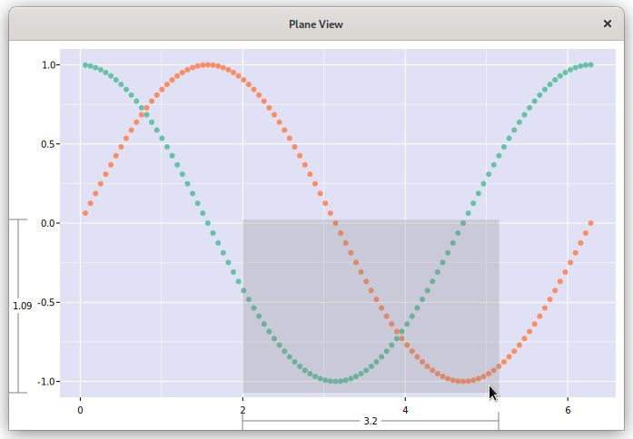
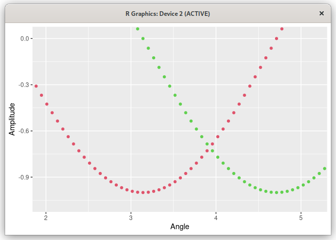

# Plane View
Yet another data plotter. It's intended to support a particular workflow.

* Call from R with data as arguments.
* Explore your data and adjust ranges.
* Return a ggplot command that can be tweaked to make a finished plot.

Plane View is not intended to produce publication-ready plots. It's not intended to be a fully featured interactive plot editor. Legends and labels are added in post.

The package *planeview* provides `pview()`, which can be called in four different ways:

1. One vector: `pview(ys)` plots the elements of `ys` vs. their indices.
1. Multiple vectors: `pview(xs, ys1, ys2, ...)` plots each of the y-vectors vs. `xs`.
1. One list of vectors: `pview(list(ys1, ys2, ...))` plots each y-vector vs. its indices.
1. Two lists of vectors: `pview(list(xs1, xs2, ...), list(ys1, ys2, ...))` plots each y-vector vs. the corresponding x-vector.

# Features
* Change ranges by dragging a box.
* X and y ranges spanned by the box are displayed while dragging.
* Escape aborts range change.
* The previous two items give a convenient way to measured distances: Drag from one point
  on the graph to another. Read the range. Hit escape.
* Undo and redo are available for range changes.
* Mouse-wheel zooming centered on the pointer. (Not sure how to handle undo here.)
* Drag along an axis to scale just that dimension.
* Hold shift to push the graph around.
* Overview: Show the graph autoscaled with a box around the current range. Move the box,
  drag edges or corners to set the new range. Could be used to look at different parts of
  a plot at a consistent magnification.
* Move by pages.

# Planned Features
* Display the coordinates of the point closest to the pointer.
* Coarse movement with Ctrl in overview.

# Not Planned
Some things are left to the ggplot2 side.

* Title and axis labels
* Legends
* Saving to a file

# Example
Here's an example session. The pview() call returns a ggplot call as a a string. Copy, paste, and add labels to get the finished plot.
```
> theta <- 1:100*pi/50
> pview(theta, cos(theta), sin(theta))
[1] "ggplot() + geom_point(aes(theta, cos(theta)), color=2) + geom_point(aes(theta, sin(theta)), color=3)
+ coord_cartesian(xlim=c(2, 5.15), ylim=c(-1.0722, 0.0217))"
> ggplot() + geom_point(aes(theta, cos(theta)), color=2) + geom_point(aes(theta, sin(theta)), color=3)
+ coord_cartesian(xlim=c(2, 5.15), ylim=c(-1.0722, 0.0217)) + labs(x='Angle', y='Amplitude')
```





